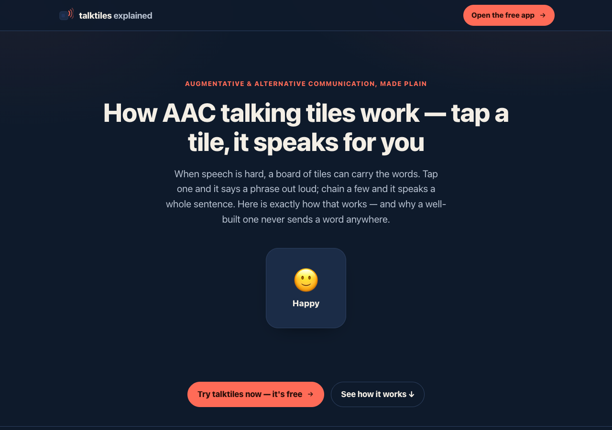

# talktiles explained

**A short, animated explainer of how a tap-to-speak AAC communication board works** —
and why a well-built one never lets a single word leave your device.

This is a single-page visual walkthrough. It is the companion to the **talktiles** app:

> **[Open the free talktiles app →](https://sreenivas-sadhu-prabhakara.github.io/talktiles/)**

## What this page is

AAC — Augmentative and Alternative Communication — sounds technical, but the idea is
simple: when speaking is hard, a board of tiles can carry the words. This page walks
through that idea with animation you can see (and tiles you can actually tap to hear):

1. **The problem** — the thought is whole, but the voice is the part that breaks.
2. **The speaking tile** — a tile is an emoji, a label, and the phrase it speaks; tap it
   and the device says it aloud, with coral sound-arcs as the visible “it's talking” cue.
3. **The sentence strip** — chain tiles into a line, then speak the whole sentence.
4. **The Fitzgerald colour key** — a thin edge-stripe that speeds recognition (people,
   actions, describing words, things, social words, questions).
5. **Private by construction** — the browser itself blocks the exit, so nothing can be
   uploaded even in principle.
6. **A short feature tour** — the Quick bar, caregiver mode, the honest voice picker,
   export and paper backup, keyboard access, and the 120-phrase starter board.

It shares the app's visual identity (midnight-navy + coral speaking-tile motif) on
purpose — the explainer and the app are meant to read as a family.

## Why explain it separately

The app does one job and does it fast. This page exists for the person deciding *whether*
a tap-to-speak board is what they (or someone they care for) need — a carer, a family
member, a teacher, a clinician doing a first pass. It answers “how does this work, and
can I trust it with private words?” before they ever open the tool.

## The privacy point, honestly

The talktiles app ships a strict Content-Security-Policy with `connect-src 'none'`. That
one directive means the page **cannot** open a network connection — no upload, no
analytics, no cloud. It is not a promise you have to trust; it is enforced by the browser.
Because there is no network path, the app also works fully offline.

This explainer page follows the same rule: it makes **no network requests** — no fonts,
scripts, images or trackers loaded from anywhere. The speech you hear when you tap the
demo tiles is synthesised by your own device's text-to-speech, using voices already
installed on it. If your device has no installed voice, the tiles still animate and show
a caption; they just can't speak.

## Features of this page

- Scroll-driven, auto-playing animation built with **only CSS and inline SVG** — no
  libraries, nothing fetched.
- **Live demo tiles** you can tap to hear on-device speech (or watch the caption if no
  voice is installed).
- Respects `prefers-reduced-motion` — every animation degrades to a static, legible state.
- WCAG-AA legible in **both light and dark**; state is never colour-only; fully
  keyboard-operable with a skip-link and visible focus rings.
- System sans typography only — no serif or display faces.

## Quickstart

No build step, no server, no install — just open `index.html`.

- **Local:** double-click `index.html`, or run a static server in the folder.
- **Hosted:** **[View it live](https://sreenivas-sadhu-prabhakara.github.io/talktiles-explained/)**

## Colour convention

The tile edge-stripes shown in the “colour key” section follow the **Modified Fitzgerald
Key** (people = yellow/ochre, actions = green, describing words = blue, things = orange,
social = pink, questions = purple), a widely-used AAC colour-coding convention (Thistle &
Wilkinson, 2009). The hues are kept muted so the navy/coral identity stays dominant, and
in the app every tag is caregiver-editable.

## Disclaimer

This page explains the idea behind an AAC communication board and is **for information
only**. A communication aid is **not a clinical AAC system and is not clinically
validated**; anyone with ongoing communication needs should work with a qualified
speech-language professional. Voice quality and availability depend entirely on the
text-to-speech voices installed on your device — some devices ship few or none. Content
verified on **2026-07-22**. This software is provided under the MIT License, “as is”,
without warranty of any kind; the author accepts no liability for any loss, injury or
damage arising from its use.

## License

[MIT](./LICENSE) © 2026 Sreenivas Sadhu Prabhakara
